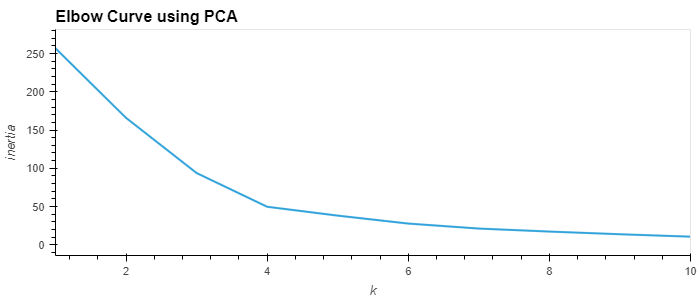

# CryptoClustering
Predict if cryptocurrencies are affected by 24-hour or 7-day price changes

## File structure
- The `img` directory contains the plots generated in the analysis
- The `Resources` directory contains the original dataset (CSV file)
- `Crypto_Clustering.ipynb` is a Jupyter notebook that contains the analysis
- `ml_commons.py` is a module that includes commonly used functions (all code is mine unless specifically specified otherwise)

## Analysis
### Approach
We compare data from different crypto currencies and propose clustring based on two different methods:
1. From normalised data only
2. Using PCA (Principal Components Analysis)

Once the data are normalised, we use the elbow method to find the optimal number of clusters. From the elbow curve (below), we conclude that `k=4` clusters is the optmial number. The Kmeans method is then used for clustering.

For the PCA part, we repeat the elbow metod and Kmeans part after calculating three principal components that represent 89% of the total variance. The elbow curve is shown below. From it, we conclude that `k=4` clusters is also the optmial number for the PCA data.

### Clustering
Both clusters are compared here for two features or PC.

## Conclusions
We reduced the number of features in the original dataset from 7 to three PCs. This makes the clustering more straightforward with only little loss in variability. Having only 3 components instead of 7 features allows to easily show the clusters, as shown below.

